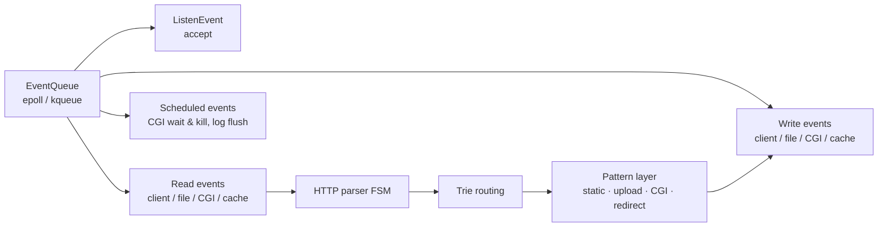

# Webserv — Event-Driven HTTP/1.1 Server in C++98

A non-blocking, single-threaded HTTP/1.1 server built from C++98, the STL, and POSIX
system calls — nothing else. 42 Seoul team project (3 people, 2023), ~19,000 lines.
The no-third-party constraint became the project's identity: the event loop, buffers,
file cache, smart pointers, and type traits — every layer the server stands on — had
to be designed by hand.

**My modules:** event system · I/O buffer · file manager / LRU cache · CGI execution ·
library layer (`libs/`) — full split in [Team](#team).

Design references: RFCs + *HTTP: The Definitive Guide* (protocol) · nginx source
(event handling, buffer chains, prefix routing) · *The Linux Programming Interface* +
epoll/kqueue man pages (syscall layer).

## Architecture

The whole server is one thread running `while (true) { pullEvents(); dispatch(); }`.
This diagram is the complete inventory of what that loop can be asked to do — network
I/O, file I/O, CGI process control, and logging all enter through the same queue,
which is what keeps any one of them from blocking the rest. Nothing in this server
ever waits: every piece of work is chunked and resumable, so one thread interleaves
progress across every connection, file, and child process at once — and coherence is
recovered not with locks, but with the lifetime rules of design decision 2.



## What this project demonstrates

| Area | What it shows | Code |
| --- | --- | --- |
| Event architecture | network, file, timer, and log work all pass through one non-blocking queue; epoll/kqueue behind a single abstraction | `srcs/Event/` |
| HTTP/1.1 | parser FSM, chunked transfer, multipart uploads, keep-alive, conditional GET with ETag over a hand-written SHA-256 | `srcs/Http/` |
| Asynchronous file I/O | disk reads/writes as chunked, resumable events in the same loop — the server never stops; coherence from reference counting + RAII alone, no threads, no locks | `srcs/FileManager/` |
| C++98 library authoring | `shared_ptr` used in 130 files, trie-based routing, SFINAE type traits | `libs/` |
| Process management | fork/execve CGI with gateway timeout, SIGKILL, and zombie reaping — all as events | `srcs/Cgi/` |

Feature set in one line: GET/POST/PUT/DELETE · keep-alive · chunked transfer ·
multipart uploads · cookies · ETag · CGI · virtual hosts · trie-routed locations ·
nginx-style config · custom error pages.

## Design decisions

### 1. Every unit of work is an event object

The most dangerous thing in a single-threaded server is code that blocks the loop
"just for a moment." This server rules that out structurally: the unit of work is not
an fd — it is an event object. Under one abstract `Event`/`EventHandler` pair sit ~14
concrete types: read/write events for clients, files, CGI pipes, and the cache, plus
scheduled events (CGI timeout, log flush). "Does this block the loop?" stops being a
code-review question and becomes a property of the type system: work that can't be
expressed as an event can't enter the server.

`EventQueue` quarantines the epoll/kqueue API differences inside one class; the event
model above it doesn't know the platform.

### 2. Lifetime is the policy — `shared_ptr` → buffers → file I/O

There are no locks and no callback registries in this server. Their job is done by
object lifetime — and the same tool does a progressively bigger job across three layers.

**`ft::shared_ptr` — the tool.** C++98 has none, so it was written from scratch —
converting constructor (concrete events travel as their abstract interfaces), aliasing
constructor (what makes `static_pointer_cast` correct) — then used in 130 files.
Object lifetime in this codebase *is* reference counting.

**Buffer chain — lifetime as memory policy.** Most requests fit in 4KB; uploads run
to tens of megabytes. So the I/O buffer is a chain — one 4KB head node, 64KB nodes
linked behind it as needed — and a node whose bytes are fully sent is freed
immediately. A small request lives and dies in one node; a 100MB transfer never holds
its peak memory. (Same problem, same answer as nginx's `ngx_chain_t`.)

**File I/O — where async had to be solved, not received.** Under I/O multiplexing,
sockets come asynchronous almost for free; disk files do not. "Serve a 100MB file"
wants to be one long blocking read — the single call that would freeze every other
client. The signature piece of this server is refusing that: disk I/O is made a full
citizen of the event loop, and the coherence problem that creates is then solved with
lifetime instead of locks.

- The read is an event like any other: the file's fd joins the same queue, and each
  firing appends one chunk to the response's buffer chain, then yields — **between
  chunks, the loop serves everyone else.** The server never stops: a 100MB file
  streams through the same thread that is answering 4KB requests.
- Once file work is interleaved, coherence becomes the problem — N clients reading a
  path while another writes it. Every path gets a small state machine —
  `{None, Reading, Writing}` — plus a reader count.
- State transitions happen only inside RAII guard constructors and destructors:
  reader guard ctor `count++`, dtor `count--`; the 0↔1 edge flips the state.
- Guards travel as `shared_ptr`, owned by the event doing the work — **holding the
  guard is holding the permission.** When the read event finishes its last chunk and
  is destroyed, the guard dies with it and the permission returns. There is no
  `unlock()` anywhere in the codebase to forget.
- Completion is detected by convergence, not callbacks: the response side re-checks
  through its own events until the buffered byte count reaches the file size, then
  transmission starts.

Small files take an LRU cache (4KB blocks) instead, where concurrent misses on the
same file coalesce into a single disk read — the cache-stampede problem handled at
design level. Write-through on small writes, eviction on growth and DELETE, and files
crossing the cacheable-size line in either direction all have defined paths.

### 3. If you fork it, you own it to the end

CGI runs via fork/execve with non-blocking pipe capture; the real problem isn't
execution, it's cleanup. An unresponsive script dies by gateway timeout — a scheduled
SIGKILL event — and every child is reaped by a `waitpid(WNOHANG)` sweep. Process
lifetime is a first-class citizen of the event loop, so the server never accumulates
zombies. Logging follows the same rule: a 32KB buffer flushed through a `LogEvent` in
the same queue — a slow disk can never delay a response.

## Library layer (`libs/`)

| Piece | What it is |
| --- | --- |
| `shared_ptr` · `unique_ptr` · `Optional` | C++98 reimplementations; `shared_ptr` is the server's skeleton (see above) |
| `Trie` | location routing — longest-prefix match in O(URI length), independent of route count |
| `Type.hpp` | SFINAE type traits (`enable_if`, `is_integral`, …) rebuilt in C++98 after reading the gcc STL source |
| Passkey idiom | zero-size key type, private ctor + `friend` — "who may touch this" enforced by the compiler; guards buffer nodes and the file table |
| Hash table | open addressing with **double hashing** (`h2(h1)` as the probe step), prime-sized with resizing over a sieve-cached prime list up to 10⁶, plus a `std::string` specialization — implemented and tested; honestly labeled: not wired into the server |

Inside `shared_ptr`, the details are the point: the **aliasing constructor** shares
one object's count while pointing at another — what makes `static_pointer_cast`
correct (no second count, no double delete); assignment is destroy-then-placement-new,
so the copy constructor stays the single definition of what ownership transfer means;
and with no variadic templates in C++98, `make_shared` is an overload family. The
passkey types work like the file guards do: a call site must present a key it cannot
construct — access control checked by the compiler, not by convention.

## Build & run

```bash
git clone https://github.com/42-webserver/webserv.git && cd webserv
make            # targets: all · clean · fclean · re · sanitize (ASan)
./run.sh        # fills config/webserv.conf.template with this clone's absolute
                # paths (the parser accepts absolute paths only), serves on :8080
```

<details>
<summary><b>Config grammar + example</b> — two parser rules: paths must be absolute, and <code>#</code> comments are not supported</summary>

`listen` takes a port or `ip:port`; `alias` replaces the matched location prefix
(vs `root`, which prepends).

```nginx
server {
    listen 8080;
    server_name www.example.com example.com;
    root /var/www/html;
    index index.html index.htm;
    error_page 404 /404.html;
    client_max_body_size 8M;

    location / {
        autoindex on;
    }

    location /redirect {
        return 301 /images;
    }

    location /images {
        alias /var/www/img;
        allow_method GET POST DELETE;
        autoindex on;
    }

    location /cgi {
        cgi_pass on;
        alias /var/www/cgi;
        allow_method GET POST;
    }
}
```

</details>

## Verification

Browser/curl (static pages, autoindex, multipart upload, DELETE, CGI) · raw `telnet`
for status lines and chunked framing · `ab -n 1000 -c 100` — the single-threaded loop
keeps serving concurrent clients through large transfers. Unit-style tests live next
to their modules (`srcs/*/Test/`, `libs/Library/Test/`).
UML: [class diagram](assets/Class%20diagram.png) ·
[sequence diagram](assets/Sequence%20diagram.png) (StarUML sources in `assets/`).

## Known limitations

- The Linux/epoll path currently has an event-registration bug: kqueue registers per
  (fd, filter) pair, epoll allows one registration per fd — so adding write interest
  to an fd already registered for reads fails with `EEXIST`. Verified end-to-end on
  macOS/kqueue; the fix (single registration with merged interest flags) is identified.
- The config parser accepts absolute paths only and no comments (see Build & run).

## Team

42 Seoul group project — [daekuelee](https://github.com/daekuelee) (event system,
buffer, file manager/LRU, CGI execution, library layer) ·
[Younganswer](https://github.com/Younganswer) (config parsing, server/vhost layer) ·
wken5577 (HTTP parsing/response, shared).
