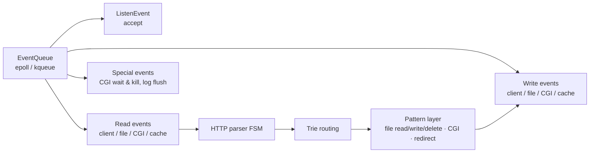

# Webserv — Event-Driven HTTP/1.1 Server in C++98

A non-blocking, single-threaded HTTP/1.1 server built from scratch as a 42 Seoul team
project (2023). No third-party libraries — C++98, the STL, and POSIX system calls only.
~19,000 lines of code across an event system, HTTP engine, buffer/file-management layer,
and a set of hand-written library components.

Design references: nginx source (event handling, buffer chains, prefix routing),
*The Linux Programming Interface*, *HTTP: The Definitive Guide*, and the epoll/kqueue
man pages.

## Features

- **HTTP/1.1**: GET / POST / PUT / DELETE, persistent connections, chunked transfer
  encoding, multipart/form-data file uploads, cookies, configurable error pages,
  full status-code table
- **Conditional GET**: ETag generation backed by a hand-written SHA-256 implementation
- **CGI**: fork/execve with CGI/1.1 meta-variables, pipe-based non-blocking capture,
  gateway timeout enforced by scheduled events (`waitpid(WNOHANG)` reaping + SIGKILL —
  no zombie processes)
- **Virtual hosting & routing**: multiple `server` blocks per port/hostname;
  longest-prefix location matching via a hand-written trie
- **nginx-style configuration**: `listen`, `server_name`, `root`, `alias`, `index`,
  `error_page`, `client_max_body_size`, `location`, `return`, `autoindex`,
  `allow_method`, `cgi_pass`
- **Cross-platform event backend**: epoll (Linux) and kqueue (macOS/BSD) behind a single
  abstraction — selected at compile time, same event model on both

## Architecture

### Event system

One `EventQueue` (epoll or kqueue) drives a single-threaded loop:
`pullEvents()` → dispatch to handlers. Every unit of work is a first-class event object —
an abstract `Event`/`EventHandler` pair with ~14 concrete types
(`ReadEventFromClient`, `WriteEventToFile`, `ReadEventFromCgi`, `CgiWaitEvent`,
`CgiKillEvent`, `LogEvent`, …). All fds run with `O_NONBLOCK`; nothing in the loop blocks.



### Request lifecycle

1. **Accept** — `ListenEvent` fires on a ready listening socket (multiple `listen`
   sockets across ports/addresses are supported); each accepted client fd is set
   non-blocking and registered with the queue.
2. **Parse** — `ReadEventFromClient` feeds bytes into the parser, an explicit state
   machine (`BEFORE → START_LINE → HEADERS → BODY → FINISH`) that handles partial
   reads across events. Body handling branches by framing: `Content-Length`, chunked
   transfer decoding, or multipart/form-data (its own boundary FSM). Malformed or
   oversized input raises a typed HTTP exception (400, 413, …) that is converted into
   an error response, and the connection is flagged for closure after sending.
3. **Route** — the request URI is matched against `location` blocks by longest-prefix
   lookup in the trie; the winning block supplies root/alias, allowed methods,
   autoindex, redirect, and CGI settings. Virtual-host selection uses the `Host`
   header against `server_name`.
4. **Generate** — the Pattern layer dispatches to a processor per outcome, each with a
   matching response builder: static file read (through the file manager — cache or
   async chunked read), directory listing when autoindex is on / index-file fallback
   when off, multipart upload storage, `return` redirects with `Location`, DELETE via
   the file deleter, and CGI (env setup → fork/execve → pipe capture, §above).
5. **Transmit** — the response is staged in the connection's buffer chain;
   `WriteEventToClient` drains it as the socket becomes writable, so large responses
   go out over multiple events without stalling anyone else. Keep-alive connections
   return to step 2 on the same socket; error/`Connection: close` paths close after
   the final bytes.

### Buffer design

Most requests fit in 4KB, but uploads and file transfers don't. The I/O buffer is a
linked chain: one **4KB head node**, then **64KB nodes** appended as needed
(`std::list<ft::shared_ptr<Node>>`). Reads append to the tail; writes drain from the
head, and fully-sent nodes are deleted immediately — large transfers never hold
peak memory, and small requests never over-allocate.

### File management

- **Async file I/O through the event loop**: files are read/written in chunks by
  `ReadEventFromFile` / `WriteEventToFile`; completion re-fires an event that resumes
  the client response. A large file transfer never blocks other clients.
- **LRU cache** (list + map, 4KB blocks) for small hot files.
- **Concurrent-access control**: each open file has a `FileData` entry with a reader
  count and RAII guards (`SyncroFileDataAndReader` / `...Writer`) whose lifetime is
  the reference count — N simultaneous readers allowed, writers get exclusive access.

### Hand-written library layer (`libs/`)

Because C++98 has none of these: `ft::shared_ptr` (used across 130 files — object
lifetime in this codebase *is* refcounting), `unique_ptr`, `Optional`, `Trie`
(drives location routing), a type-traits/SFINAE header (`enable_if`,
`integral_constant`, `is_same`, …), `Assert`, and a prime-sized double-hashing
hash table (standalone; not wired into the server).

API surfaces are deliberately narrowed — e.g. the passkey idiom gates buffer-node
and file-table access to their owning managers only.

### Logging

The logger buffers 32KB and flushes through a `LogEvent` in the same queue as network
I/O — logging never blocks the loop.

UML: [class diagram](assets/Class%20diagram.png) ·
[sequence diagram](assets/Sequence%20diagram.png) (StarUML source in `assets/`).

## Configuration

Real grammar accepted by the parser (see `config/webserv.conf` for a fuller sample —
adjust its paths to your machine):

```nginx
server {
    listen 8080;                      # or ip:port, e.g. 127.0.0.1:80
    server_name www.example.com example.com;
    root /var/www/html;
    index index.html index.htm;
    error_page 404 /404.html;
    client_max_body_size 8M;

    location / {
        autoindex on;
    }

    location /redirect {
        return 301 /images;
    }

    location /images {
        alias /var/www/img;           # alias replaces the matched prefix
        allow_method GET POST DELETE;
        autoindex on;
    }

    location /cgi {
        cgi_pass on;
        alias /var/www/cgi;
        allow_method GET POST;
    }
}
```

## Build & Run

Requires a C++98-capable compiler and Make (tested with GCC/Clang on Linux and macOS).

```bash
git clone https://github.com/42-webserver/webserv.git
cd webserv
make            # targets: all · clean · fclean · re · sanitize (ASan build)
./webserv config/webserv.conf
```

A config file argument is required. Binding ports below 1024 needs elevated privileges.

## Testing

- **Browser / curl**: static pages, autoindex listings, custom error pages,
  `curl -F 'file=@photo.jpg' http://localhost:8080/images/` (multipart upload),
  `curl -X DELETE`, CGI GET/POST.
- **Raw protocol**: `telnet localhost 8080` and hand-typed requests to inspect
  status lines, headers, chunked framing.
- **Load**: `ab -n 1000 -c 100 http://localhost:8080/` — the single-threaded loop
  serves concurrent clients without stalling on large transfers.
- **Unit-style tests** live next to their modules (`srcs/*/Test/`,
  `libs/Library/Test/`) as standalone compilation units; `test/` holds manual
  fixtures (chunked bodies, upload files, a request script).

## Team

42 Seoul group project — [daekuelee](https://github.com/daekuelee) (event system,
buffer, file manager/LRU, CGI execution, library layer),
[Younganswer](https://github.com/Younganswer) (config parsing, server/vhost layer),
wken5577 (HTTP parsing/response, shared). HTTP engine work was shared across the team.
